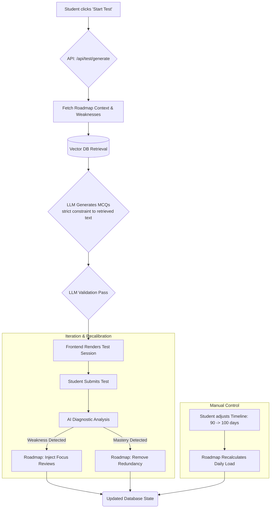

# Create Test & Adaptive Roadmap Integration Flow

> **NOTE TO FUTURE DEVELOPERS (HUMAN & AI):** This document defines the exact architecture, data flows, and LLM constraints required to build the backend logic for the contextual "Create Test" flow. Strict adherence to this RAG (Retrieval-Augmented Generation) pipeline is required to ensure medical accuracy.

## 🎯 1. Architectural Philosophy

The platform operates on a strict **Roadmap-Driven** philosophy. 
- **Content Hub:** The passive repository of reading material, videos, and transcripts. 
- **Create Test (/student/create-test):** The active execution engine. It acts as the bridge translating the Roadmap's daily requirements into actionable practice sessions.

When a user navigates to `/student/create-test`, the application does not simply query a static database of pre-written questions. Instead, it triggers a dynamic AI generation pipeline that crafts questions tailored precisely to the student's roadmap position, utilizing strictly approved learning resources.

---

## 🔄 2. The "Create Test" Experience (Frontend Flow)

1. **Context Acquisition:** The system queries the `RoadmapEngine` for the user's `currentDayContext`.
2. **Auto-Configuration:** 
   - If the active roadmap day dictates "Pharmacology - Cardiovascular Drugs", the Test Builder automatically selects this tagging.
   - It calculates the ideal question count based on the roadmap's estimated session time (e.g., 1.5 hours ≈ 40 questions).
  - Mode defaults to "Timed" (review shown after submission).
  - During active timed solving, no explanation text/video is shown; explanations render only in post-test review.
3. **User Agency:** A toggle ("Custom Test") allows the user to break free from the roadmap temporarily.

---

## 🧠 3. Dynamic RAG Pipeline: How the AI Generates Tests (Backend Flow)

Because this platform prepares students for rigorous medical boards (USMLE), **zero hallucination is tolerable.** The AI must use a strict Retrieval-Augmented Generation (RAG) pipeline based *only* on the resources provided in the Content Hub.

### Step A: The Request Payload
When the frontend sends a request to generate the test, it provides exact guardrails:
```json
{
  "studentId": "user_123",
  "roadmapContext": {
    "subject": "Pharmacology",
    "topic": "Cardiovascular Drugs",
    "subtopics": ["Beta Blockers", "ACE Inhibitors"]
  },
  "questionCount": 10,
  "difficultyTarget": "Medium-Hard",
  "historicalWeaknesses": ["Mechanism of action for ACE Inhibitors"]
}
```

### Step B: Vector Retrieval (Content Hub)
The backend intercepts this payload and queries the Vector Database (e.g., Pinecone/Weaviate).
- It retrieves the top `N` text chunks from verified PDFs, video transcripts, and lecture notes matching the requested subtopics.
- It heavily weights retrieval towards the student's `historicalWeaknesses`.

### Step C: LLM Generation Prompt (System Prompting)
The retrieved chunks are passed to the Generator LLM (e.g., GPT-4 / Claude Opus).
**The Prompt Contract MUST include:**
1. **Role:** "You are an expert USMLE Step 1 item writer."
2. **Constraint:** "Use ONLY the provided retrieved context to generate the question. Do not introduce outside medical knowledge that conflicts with or isn't present in the context."
3. **Format Checklist:**
   - **Stem:** A multi-step clinical vignette (patient age, presentation, vitals, labs).
   - **Lead-in:** The actual question (e.g., "Which of the following is the most likely mechanism...?").
   - **Choices:** 5 plausible options (A-E), with 1 correct answer and 4 distractors.
   - **Explanation:** Detailed rationale for why the correct answer is right AND why *each* distractor is wrong.
   - **Citation:** Strict deep-link reference back to the original source chunk (e.g., "See Video: Cardio Phama at 12:44").

### Step D: Verification Pass
Before returning to the frontend, a secondary, smaller/faster LLM validates the output:
- Is the correct answer definitively correct based *only* on the text?
- Are the distractors plausible but definitively wrong?
- Does it adhere to the JSON schema?

---

## 🧬 4. Dynamic Roadmap Recalibration

The roadmap is a living entity. It molds itself around the user's cognitive footprint.

### A. Performance-Based Molding (Micro-Adjustments)
Upon clicking "End Test", the AI generates a diagnostic payload:
- **High Mastery (e.g., >80%):** The roadmap accelerates. Redundant future review days are excised, freeing up time.
- **Weakness Detected (e.g., <60%):** The AI flags the specific subtopic. 
  - **The Mold:** The roadmap dynamically reshuffles upcoming days to inject targeted review sessions. The weak subjects explicitly appear *more frequently* in the user's future.

### B. Manual Timeline Expansion (Macro-Adjustments)
Users frequently experience life events that require roadmap shifts.
- **The Feature:** A Timeline Adjuster slider (e.g., "Change duration from 90 days to 100 days").
- **The Recalibration:** When the timeline is expanded by 10 days, the AI algorithm distributes the remaining content over the larger timeframe.
  - Daily hour requirements decrease, minimizing burnout.
  - Or, if daily hours remain constant, the space is flooded with deep-dive review sessions for historically weak topics.

---

## 🛠 5. Flow Diagram for Future AI Developers



## 📝 6. Actionable Implementation Notes for Upcoming AI Agents
1. **Schema Definition:** When implementing the backend, ensure the `/api/test/generate` endpoint utilizes strict validation (e.g., Zod) to enforce the JSON structure coming from the LLM. 
2. **Metadata Tagging:** Ensure the Content Hub ingestion script properly applies metadata tags (Subject, Subtopic, Media Type) to chunks *before* embedding. Retrieval heavily relies on precise metadata filtering to avoid pulling Pathology content when Pharmacology is requested.
3. **UI Flexibility:** In `/student/create-test`, build the UI so that if the LLM generation takes 5-10 seconds, there is a polished placeholder skeleton loader or "AI Building Your Test" splash animation to manage user expectations.
